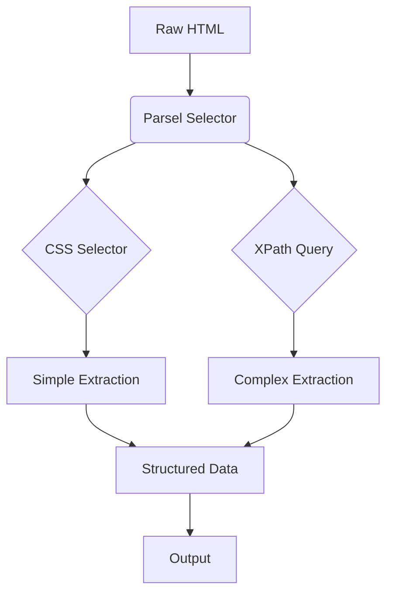

# Guide to Parsel: HTML Parsing in Python Summary

## Key Concepts
- **Parsel**: Python library for HTML/XML parsing (lxml wrapper)
- **Dual Query Systems**: CSS selectors (simple) + XPath (complex)
- **Core Features**:
  - `re:test()`: Regex matching in XPath
  - `has-class()`: Class attribute detection
  - Automatic CSS → XPath conversion
- **Scrapy Integration**: Default parser for Scrapy framework
- **AI Enhancement**: Scrapfly API for auto-extraction

## Tools/Libraries
- **Primary**: Parsel
- **Dependencies**: lxml, cssselect
- **Extensions**: 
  - Scrapy (web scraping framework)
  - Scrapfly (AI-powered extraction)
- **Debugging**: Browser DevTools for selector validation

## Implementation Strategies
### Basic Patterns
```python
# CSS Selection
title = selector.css('.product-title::text').get()

# XPath Selection
price = selector.xpath('//span[@class="price"]/text()').get()
```

### Advanced Techniques
```python
# Regex Matching
discounted = selector.xpath('//*[re:test(text(), "\d+% off")]').get()

# Tree Navigation
sibling = selector.xpath('//h2/following-sibling::div[1]').get()
```

### HTML Structure Handling
```python
# Nested Parsing
for product in selector.css('.products'):
    name = product.css('.name::text').get()
    features = {
        row.xpath('.//td[1]/text()').get(): 
        row.xpath('.//td[2]/text()').get()
        for row in product.css('tr')
    }
```

## Best Practices
1. **Selector Choice**:
   - CSS for class/ID based selection
   - XPath for hierarchical/conditional queries
2. **Robust Extraction**:
   - Use `.get(default='')` to avoid None
   - Combine CSS and XPath in complex scenarios
3. **Dynamic Content**:
   - Leverage `contains()` for partial text
   - Use `re:test()` for pattern matching
4. **Performance**:
   - Scope selectors to specific elements
   - Prefer direct paths over // searches
5. **Debugging**:
   - Test selectors in browser console
   - Use `repr(selector.get())` for HTML inspection

## Framework Patterns


## CLI Commands
```bash
# Installation
pip install parsel

# Validation Test
python -c "from parsel import Selector; \
html='<div class=\"test\">value</div>'; \
print(Selector(text=html).css('.test::text').get())"
```

## Navigation Logic
1. **Initialization**:
   - Load HTML into Selector object
2. **Query Selection**:
   - Assess HTML complexity
   - Choose CSS for simplicity/XPath for power
3. **Execution**:
   - Extract text/attributes
   - Handle lists with `.getall()`
4. **Post-Processing**:
   - Clean extracted data
   - Structure into dictionaries/objects
5. **Error Recovery**:
   - Implement fallback selectors
   - Use try/except blocks
