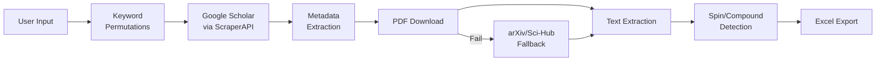

# Scholarly Paper Crawler Summary

## Key Concepts
- **Automated Literature Review**: End-to-end pipeline for academic paper discovery and analysis
- **Quantum Spin Extraction**: Identifies and validates spin values following quantum mechanical principles
- **Combinatorial Search**: Generates all keyword permutations for comprehensive coverage
- **API-Based Scraping**: Uses ScraperAPI for Google Scholar access
- **Structured Data Export**: Organizes results in Excel with extracted metadata

## Tools/Libraries
- **Core**: Python 3.8+
- **APIs**: 
  - ScraperAPI (Google Scholar access)
  - arXiv API (alternative paper source)
- **Libraries**:
  - Cloudscraper (bypasses DDoS protection)
  - BeautifulSoup (HTML parsing)
  - PyPDF2 (text extraction)
  - openpyxl (Excel export)
- **Infrastructure**: Windows batch processing (.bat)

## Implementation Strategies
### Keyword Permutation
```python
from itertools import permutations

def generate_combinations(keywords):
    all_combos = []
    for r in range(1, len(keywords)+1):
        all_combos.extend([' '.join(p) for p in permutations(keywords, r)])
    return all_combos

# Example: 
# generate_combinations(["2D", "ferromagnetic"]) 
# → ['2D', 'ferromagnetic', '2D ferromagnetic', 'ferromagnetic 2D']
```

### Spin Validation
```python
VALID_SPINS = {0, 0.5, 1, 1.5, 2, 2.5}

def validate_spin(input_str):
    try:
        if '/' in input_str:
            num, denom = map(int, input_str.split('/'))
            value = num / denom
            return value if value in VALID_SPINS else None
        return float(input_str) if float(input_str) in VALID_SPINS else None
    except:
        return None
```

### PDF Processing
```python
from PyPDF2 import PdfReader

def extract_first_sentences(pdf_path, num=100):
    reader = PdfReader(pdf_path)
    text = ""
    for page in reader.pages:
        text += page.extract_text()
        if len(text.split('. ')) >= num:
            return '. '.join(text.split('. ')[:num])
    return text
```

## Best Practices
1. **API Management**:
   - Monitor usage via ScraperAPI dashboard
   - Start with free tier (5,000 requests)
   - Upgrade to paid plans for large projects
   - Implement usage tracking in code

2. **Network Safety**:
   - Use personal networks/VPNs (not institutional)
   - Rotate IP addresses
   - Set 60s minimum delay between requests
   - Avoid simultaneous executions

3. **Execution Planning**:
   - Estimate runtime: 15 combinations ≈ 5 hours
   - Start sessions with `webcrawler_paper_search.bat`
   - Prioritize critical keywords first
   - Monitor console for errors

4. **Data Quality**:
   - Verify extracted spin/compound values
   - Check PDF download success rate
   - Review first 100 sentences for accuracy
   - Compare multiple sources (Google Scholar, arXiv)

## Framework Patterns


## CLI Commands
```bat
REM Run pipeline
webcrawler_paper_search.bat

REM Directory structure
pdf_files/
└── session_name/       # PDFs organized by session
csv_files/              # Excel results
html_parsing/           # Raw HTML for debugging
arXiv_xml/              # arXiv API responses
pdf_first_100_sentences/ # Text excerpts
```

## Navigation Logic
1. **Initialization**:
   - Configure `inputs.txt` with API key and parameters
   - Define search session name
   - Specify keywords and search depth

2. **Execution**:
   - Process each keyword combination
   - Respect rate limits (60s+ between requests)
   - Fallback to arXiv when Sci-Hub fails
   - Validate quantum spins during extraction

3. **Output Handling**:
   - Save PDFs in author-year format
   - Export metadata to Excel
   - Store raw HTML/XML for auditing
   - Generate text excerpts for quick review

4. **Post-Processing**:
   - Analyze Excel results
   - Verify data quality
   - Iterate on keyword selection
