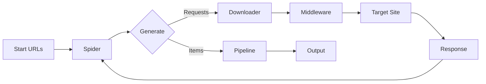

# Web Scraping With Scrapy Summary

## Key Concepts
- **Asynchronous Architecture**: Built on Twisted for high-concurrency scraping
- **Component Separation**:
  - Spiders: Define scraping logic and URL discovery
  - Items: Data containers for scraped information
  - Pipelines: Post-process and validate scraped items
  - Middlewares: Process requests/responses
- **Generator-Based Workflow**: Yield Requests or Items instead of returning
- **Selector Systems**: XPath and CSS for element targeting

## Tools/Libraries
- **Core Framework**: Scrapy
- **Essential Extensions**:
  - scrapy-playwright: Browser automation integration
  - scrapy-rotating-proxies: Automatic proxy rotation
  - scrapy-redis: Distributed crawling support
  - scrapy-sentry: Error monitoring integration
- **Anti-Blocking**: ScrapFly SDK for bypassing protections

## Implementation Strategies
### Spider Configuration
```python
class ProductSpider(scrapy.Spider):
    name = 'products'
    custom_settings = {
        'CONCURRENT_REQUESTS': 8,
        'DOWNLOAD_DELAY': 0.5
    }
    
    def start_requests(self):
        yield scrapy.Request('https://example.com/products', 
                            callback=self.parse_listing)
```

### Data Extraction
```python
def parse_product(self, response):
    loader = ItemLoader(item=ProductItem(), response=response)
    loader.add_xpath('title', '//h1/text()')
    loader.add_css('price', '.price::text')
    loader.add_value('url', response.url)
    yield loader.load_item()
```

### Middleware Example
```python
class BlocklistMiddleware:
    def process_request(self, request, spider):
        if 'blocked' in request.url:
            return IgnoreRequest("URL blocked")
        return None
```

## Best Practices
1. **Performance Tuning**:
   - Adjust `CONCURRENT_REQUESTS` based on target site
   - Use `AUTOTHROTTLE_ENABLED` for dynamic speed adjustment
   - Enable `HTTPCACHE` during development
   
2. **Stealth Configuration**:
   - Rotate user agents with `scrapy-fake-useragent`
   - Use residential proxies via middleware
   - Set referer headers automatically

3. **Error Handling**:
   - Implement retry middleware with custom policies
   - Use `ERRBACK` for custom failure handling
   - Log detailed error information

4. **Data Management**:
   - Use ItemLoaders for consistent data parsing
   - Validate items with Item Pipelines
   - Export to multiple formats via FEEDS setting

## Framework Patterns


## CLI Commands
```bash
# Create project
scrapy startproject project_name

# Generate spider template
scrapy genspider products example.com

# Run with output
scrapy crawl products -o results.jl

# Debug response
scrapy shell -s USER_AGENT="Mozilla" "https://example.com"

# Check contracts
scrapy check products
```

## Navigation Logic
1. **Initialization**:
   - Load start URLs
   - Apply middleware configurations
   - Set concurrency settings
   
2. **Crawling Process**:
   - Discover links via XPath/CSS selectors
   - Follow pagination with relative URL resolution
   - Handle redirects and HTTP errors
   
3. **Data Processing**:
   - Extract structured data using selectors
   - Clean/normalize values in ItemLoaders
   - Validate through pipelines
   
4. **Output**:
   - Export to JSON/CSV via FEEDS
   - Store in databases via pipelines
   - Handle incremental scraping
