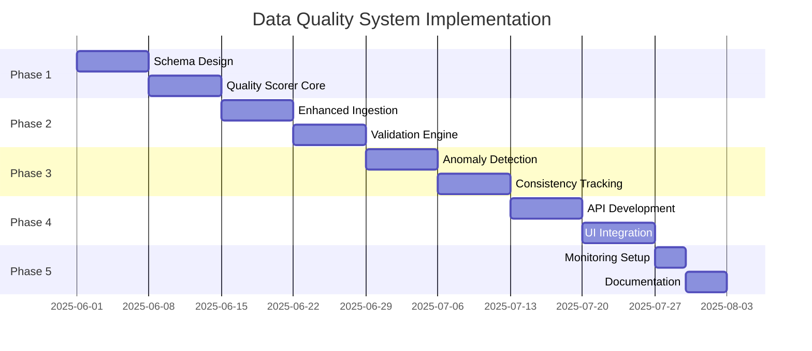

# Data Quality Scoring Implementation Plan for Event Data

This plan outlines a comprehensive approach to implementing a trust-based data quality system using MongoDB, designed to track and score the reliability of scraped event data.

---

## Phase 1: Foundation Setup (Week 1-2)

### 1.1 Enhanced Database Schema

**Collections Structure:**

```javascript
// 1. events collection (enhanced with quality metadata)
{
  "_id": ObjectId("..."),
  "url": "https://ticketsibiza.com/event/...",
  "scrapedAt": ISODate("2025-05-26T03:41:34Z"),
  "extractionMethod": "jsonld",
  
  // Core event data
  "title": "Glitterbox 25th May 2025",
  "location": { /* ... */ },
  "dateTime": { /* ... */ },
  "lineUp": [ /* ... */ ],
  "ticketInfo": { /* ... */ },
  
  // Quality metadata
  "_quality": {
    "scores": {
      "title": 0.95,
      "location": 0.90,
      "dateTime": 0.95,
      "lineUp": 0.85,
      "ticketInfo": 0.88
    },
    "overall": 0.91,
    "lastCalculated": ISODate("2025-05-26T04:00:00Z")
  },
  
  // Validation tracking
  "_validation": {
    "title": {
      "method": "jsonld",
      "confidence": 0.95,
      "lastChecked": ISODate("2025-05-26T03:41:34Z"),
      "flags": []
    },
    "lineUp": {
      "method": "html_parsing",
      "confidence": 0.85,
      "lastChecked": ISODate("2025-05-26T03:41:34Z"),
      "flags": ["partial_extraction"],
      "itemValidation": {
        "Glitterbox": { "confidence": 0.95, "verified": true },
        "Diry Channels": { "confidence": 0.75, "verified": false }
      }
    }
  }
}

// 2. quality_rules collection
{
  "_id": ObjectId("..."),
  "ruleType": "venue_validation",
  "field": "location.venue",
  "conditions": {
    "knownVenues": ["Hï Ibiza", "Pacha", "Amnesia", "Ushuaïa"],
    "fuzzyMatch": true,
    "threshold": 0.85
  },
  "weight": 0.3
}

// 3. scrape_history collection
{
  "_id": ObjectId("..."),
  "eventUrl": "https://ticketsibiza.com/event/...",
  "scrapedAt": ISODate("2025-05-26T03:41:34Z"),
  "field": "ticketInfo.startingPrice",
  "value": 60,
  "extractionMethod": "jsonld",
  "confidence": 0.95
}

// 4. data_anomalies collection
{
  "_id": ObjectId("..."),
  "eventId": ObjectId("..."),
  "detectedAt": ISODate("2025-05-26T04:00:00Z"),
  "type": "price_outlier",
  "field": "ticketInfo.startingPrice",
  "value": 500,
  "expectedRange": { "min": 30, "max": 200 },
  "severity": "high",
  "resolved": false
}
```

### 1.2 Quality Scoring Engine Components

```python
# quality_scorer.py
class QualityScorer:
    def __init__(self, db):
        self.db = db
        self.extraction_weights = {
            "jsonld": 0.95,
            "microdata": 0.90,
            "opengraph": 0.85,
            "html_parsing": 0.70,
            "fallback": 0.50
        }
    
    def calculate_field_score(self, field_data, field_name):
        """Calculate quality score for a specific field"""
        base_score = self.extraction_weights.get(
            field_data.get('extractionMethod', 'fallback'), 
            0.50
        )
        
        # Apply modifiers
        modifiers = []
        
        # Consistency check
        if field_name in ['title', 'location', 'dateTime']:
            consistency_score = self.check_consistency(field_data)
            modifiers.append(consistency_score)
        
        # Validation rules
        validation_score = self.apply_validation_rules(field_data, field_name)
        modifiers.append(validation_score)
        
        # Time decay
        time_decay = self.calculate_time_decay(field_data.get('lastVerified'))
        modifiers.append(time_decay)
        
        # Calculate final score
        if modifiers:
            final_score = base_score * (sum(modifiers) / len(modifiers))
        else:
            final_score = base_score
            
        return min(max(final_score, 0.0), 1.0)  # Clamp between 0 and 1
```

---

## Phase 2: Core Implementation (Week 3-4)

### 2.1 Data Ingestion with Quality Tracking

```python
# enhanced_ingestion.py
import json
from datetime import datetime
from pymongo import MongoClient
import hashlib

class EnhancedEventIngestion:
    def __init__(self, mongo_uri):
        self.client = MongoClient(mongo_uri)
        self.db = self.client.event_database
        self.scorer = QualityScorer(self.db)
    
    def ingest_event(self, event_data):
        """Ingest event with quality scoring"""
        
        # 1. Calculate quality scores for each field
        quality_metadata = self._calculate_quality_metadata(event_data)
        
        # 2. Store scrape history
        self._store_scrape_history(event_data)
        
        # 3. Check for anomalies
        anomalies = self._detect_anomalies(event_data)
        if anomalies:
            self._store_anomalies(event_data, anomalies)
        
        # 4. Prepare document with quality metadata
        event_doc = {
            **event_data,
            "_quality": quality_metadata,
            "_validation": self._generate_validation_data(event_data),
            "lastUpdated": datetime.utcnow()
        }
        
        # 5. Upsert event
        self.db.events.update_one(
            {"url": event_data["url"]},
            {"$set": event_doc},
            upsert=True
        )
    
    def _calculate_quality_metadata(self, event_data):
        """Calculate quality scores for all fields"""
        scores = {}
        
        # Score each major field
        for field in ['title', 'location', 'dateTime', 'lineUp', 'ticketInfo']:
            if field in event_data:
                scores[field] = self.scorer.calculate_field_score(
                    event_data[field], 
                    field
                )
        
        # Calculate overall score
        overall = sum(scores.values()) / len(scores) if scores else 0.0
        
        return {
            "scores": scores,
            "overall": round(overall, 2),
            "lastCalculated": datetime.utcnow()
        }
```

### 2.2 Validation Rules Engine

```python
# validation_engine.py
class ValidationEngine:
    def __init__(self, db):
        self.db = db
        self.rules = self._load_validation_rules()
    
    def validate_field(self, field_name, value, context=None):
        """Apply validation rules to a field"""
        applicable_rules = [r for r in self.rules if r['field'] == field_name]
        
        validation_results = []
        for rule in applicable_rules:
            result = self._apply_rule(rule, value, context)
            validation_results.append(result)
        
        # Aggregate results
        if not validation_results:
            return 1.0  # No rules = assume valid
        
        weighted_score = sum(r['score'] * r['weight'] for r in validation_results)
        total_weight = sum(r['weight'] for r in validation_results)
        
        return weighted_score / total_weight if total_weight > 0 else 0.5
    
    def _apply_rule(self, rule, value, context):
        """Apply a specific validation rule"""
        rule_type = rule['ruleType']
        
        if rule_type == 'venue_validation':
            return self._validate_venue(value, rule['conditions'])
        elif rule_type == 'price_range':
            return self._validate_price_range(value, rule['conditions'], context)
        elif rule_type == 'date_validation':
            return self._validate_date(value, rule['conditions'])
        # Add more rule types as needed
        
    def _validate_venue(self, venue_name, conditions):
        """Validate venue against known venues"""
        known_venues = conditions.get('knownVenues', [])
        
        if venue_name in known_venues:
            return {'score': 1.0, 'weight': conditions.get('weight', 1.0)}
        
        if conditions.get('fuzzyMatch'):
            # Implement fuzzy matching logic
            from difflib import SequenceMatcher
            
            best_match = max(
                (SequenceMatcher(None, venue_name.lower(), kv.lower()).ratio() 
                 for kv in known_venues),
                default=0
            )
            
            if best_match >= conditions.get('threshold', 0.85):
                return {'score': best_match, 'weight': conditions.get('weight', 1.0)}
        
        return {'score': 0.3, 'weight': conditions.get('weight', 1.0)}
```

---

## Phase 3: Advanced Features (Week 5-6)

### 3.1 Anomaly Detection System

```python
# anomaly_detection.py
import numpy as np
from datetime import datetime, timedelta

class AnomalyDetector:
    def __init__(self, db):
        self.db = db
    
    def detect_anomalies(self, event_data):
        """Detect various types of anomalies in event data"""
        anomalies = []
        
        # Price anomalies
        if 'ticketInfo' in event_data:
            price_anomaly = self._check_price_anomaly(event_data)
            if price_anomaly:
                anomalies.append(price_anomaly)
        
        # Date anomalies
        if 'dateTime' in event_data:
            date_anomaly = self._check_date_anomaly(event_data)
            if date_anomaly:
                anomalies.append(date_anomaly)
        
        # Lineup anomalies
        if 'lineUp' in event_data:
            lineup_anomalies = self._check_lineup_anomalies(event_data)
            anomalies.extend(lineup_anomalies)
        
        return anomalies
    
    def _check_price_anomaly(self, event_data):
        """Check if ticket price is anomalous"""
        venue = event_data.get('location', {}).get('venue')
        price = event_data.get('ticketInfo', {}).get('startingPrice')
        
        if not venue or not price:
            return None
        
        # Get historical price data for venue
        pipeline = [
            {"$match": {"location.venue": venue}},
            {"$group": {
                "_id": None,
                "avgPrice": {"$avg": "$ticketInfo.startingPrice"},
                "stdDev": {"$stdDevPop": "$ticketInfo.startingPrice"},
                "minPrice": {"$min": "$ticketInfo.startingPrice"},
                "maxPrice": {"$max": "$ticketInfo.startingPrice"}
            }}
        ]
        
        stats = list(self.db.events.aggregate(pipeline))
        if not stats:
            return None
        
        stats = stats[0]
        avg_price = stats.get('avgPrice', 0)
        std_dev = stats.get('stdDev', 0)
        
        # Check if price is outside 3 standard deviations
        if std_dev > 0 and abs(price - avg_price) > 3 * std_dev:
            return {
                "type": "price_outlier",
                "field": "ticketInfo.startingPrice",
                "value": price,
                "expectedRange": {
                    "min": max(0, avg_price - 3 * std_dev),
                    "max": avg_price + 3 * std_dev
                },
                "severity": "high" if abs(price - avg_price) > 5 * std_dev else "medium",
                "message": f"Price {price} is significantly different from average {avg_price:.2f}"
            }
        
        return None
```

### 3.2 Consistency Tracking

```python
# consistency_tracker.py
class ConsistencyTracker:
    def __init__(self, db):
        self.db = db
    
    def check_field_consistency(self, event_url, field_name, current_value):
        """Check consistency of a field across multiple scrapes"""
        
        # Get historical values
        history = list(self.db.scrape_history.find({
            "eventUrl": event_url,
            "field": field_name
        }).sort("scrapedAt", -1).limit(10))
        
        if len(history) < 2:
            return 1.0  # Not enough history
        
        # Calculate consistency score
        values = [h['value'] for h in history]
        
        if isinstance(current_value, (int, float)):
            # Numerical consistency
            return self._calculate_numerical_consistency(values)
        else:
            # String consistency
            return self._calculate_string_consistency(values)
    
    def _calculate_string_consistency(self, values):
        """Calculate consistency for string values"""
        unique_values = set(values)
        
        if len(unique_values) == 1:
            return 1.0
        
        # Calculate mode frequency
        from collections import Counter
        value_counts = Counter(values)
        mode_count = value_counts.most_common(1)[0][1]
        
        return mode_count / len(values)
```

---

## Phase 4: Integration & UI (Week 7-8)

### 4.1 API Endpoints for Quality Data

```python
# quality_api.py
from flask import Flask, jsonify, request
from bson import ObjectId

app = Flask(__name__)

@app.route('/api/events/<event_id>/quality', methods=['GET'])
def get_event_quality(event_id):
    """Get quality scores for an event"""
    event = db.events.find_one({"_id": ObjectId(event_id)})
    
    if not event:
        return jsonify({"error": "Event not found"}), 404
    
    quality_data = {
        "eventId": str(event['_id']),
        "title": event.get('title'),
        "quality": event.get('_quality', {}),
        "validation": event.get('_validation', {}),
        "recommendations": generate_quality_recommendations(event)
    }
    
    return jsonify(quality_data)

@app.route('/api/events/low-quality', methods=['GET'])
def get_low_quality_events():
    """Get events with low quality scores"""
    threshold = float(request.args.get('threshold', 0.7))
    
    events = list(db.events.find({
        "_quality.overall": {"$lt": threshold}
    }).limit(100))
    
    return jsonify({
        "count": len(events),
        "events": [format_event_summary(e) for e in events]
    })

def generate_quality_recommendations(event):
    """Generate recommendations for improving data quality"""
    recommendations = []
    
    if event.get('_quality', {}).get('overall', 1.0) < 0.7:
        # Identify lowest scoring fields
        scores = event.get('_quality', {}).get('scores', {})
        low_fields = [f for f, s in scores.items() if s < 0.6]
        
        for field in low_fields:
            recommendations.append({
                "field": field,
                "currentScore": scores[field],
                "action": f"Verify {field} data manually or find additional sources"
            })
    
    return recommendations
```

### 4.2 MongoDB Aggregation Pipelines

```javascript
// Quality Dashboard Queries

// 1. Overall quality distribution
db.events.aggregate([
  {
    $bucket: {
      groupBy: "$_quality.overall",
      boundaries: [0, 0.5, 0.7, 0.85, 0.95, 1.01],
      default: "Unknown",
      output: {
        count: { $sum: 1 },
        events: { $push: "$title" }
      }
    }
  }
]);

// 2. Field-specific quality analysis
db.events.aggregate([
  {
    $project: {
      qualityScores: { $objectToArray: "$_quality.scores" }
    }
  },
  {
    $unwind: "$qualityScores"
  },
  {
    $group: {
      _id: "$qualityScores.k",
      avgScore: { $avg: "$qualityScores.v" },
      minScore: { $min: "$qualityScores.v" },
      maxScore: { $max: "$qualityScores.v" },
      count: { $sum: 1 }
    }
  }
]);

// 3. Anomaly trends
db.data_anomalies.aggregate([
  {
    $match: {
      detectedAt: { $gte: ISODate("2025-05-01") }
    }
  },
  {
    $group: {
      _id: {
        type: "$type",
        day: { $dateToString: { format: "%Y-%m-%d", date: "$detectedAt" } }
      },
      count: { $sum: 1 }
    }
  },
  {
    $sort: { "_id.day": 1 }
  }
]);
```

---

## Phase 5: Monitoring & Maintenance

### 5.1 Automated Quality Monitoring

```python
# quality_monitor.py
import schedule
import time
from datetime import datetime, timedelta

class QualityMonitor:
    def __init__(self, db, alert_service):
        self.db = db
        self.alert_service = alert_service
    
    def run_quality_checks(self):
        """Run periodic quality checks"""
        
        # Check for degrading quality
        degrading_events = self._find_degrading_quality()
        if degrading_events:
            self.alert_service.send_alert(
                "Quality Degradation Detected",
                f"Found {len(degrading_events)} events with declining quality scores"
            )
        
        # Check for unresolved anomalies
        old_anomalies = self._find_old_anomalies()
        if old_anomalies:
            self.alert_service.send_alert(
                "Unresolved Anomalies",
                f"{len(old_anomalies)} anomalies pending resolution"
            )
        
        # Update quality scores for stale events
        self._refresh_stale_scores()
    
    def _find_degrading_quality(self):
        """Find events where quality is decreasing"""
        pipeline = [
            {
                "$match": {
                    "_quality.lastCalculated": {
                        "$gte": datetime.utcnow() - timedelta(days=7)
                    }
                }
            },
            {
                "$lookup": {
                    "from": "quality_history",
                    "localField": "_id",
                    "foreignField": "eventId",
                    "as": "history"
                }
            },
            {
                "$match": {
                    "$expr": {
                        "$lt": [
                            "$_quality.overall",
                            { "$avg": "$history.score" }
                        ]
                    }
                }
            }
        ]
        
        return list(self.db.events.aggregate(pipeline))

# Schedule monitoring
schedule.every(6).hours.do(monitor.run_quality_checks)
```

---

## Implementation Timeline



---

## Key Benefits

1. **Transparency:** Users and developers can see why certain data might be unreliable
2. **Automated Quality Control:** Identify and flag questionable data automatically
3. **Improved User Trust:** Show confidence indicators in your UI
4. **Better Decision Making:** Use quality scores to prioritize manual verification efforts
5. **Enhanced Recommendations:** Weight recommendations by data quality

---

## Next Steps

1. **Setup MongoDB Instance:** Either locally or using MongoDB Atlas
2. **Install Dependencies:** `pymongo`, `python-dateutil`, `flask`, `schedule`
3. **Implement Phase 1:** Start with the enhanced schema and basic quality scoring
4. **Test with Sample Data:** Use your existing scraped data to test the system
5. **Iterate and Improve:** Refine scoring algorithms based on real-world results

This comprehensive plan provides a robust foundation for implementing a data quality scoring system that will significantly improve the reliability and trustworthiness of your event data.
