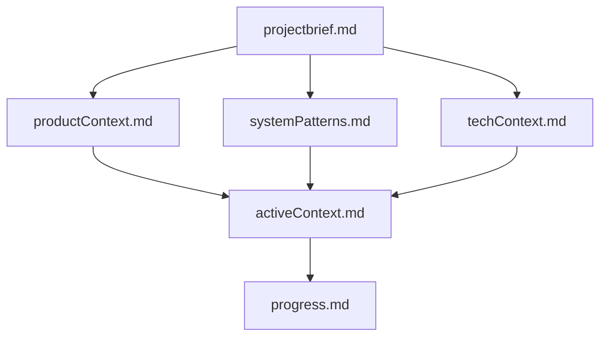
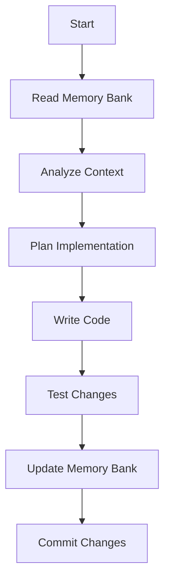
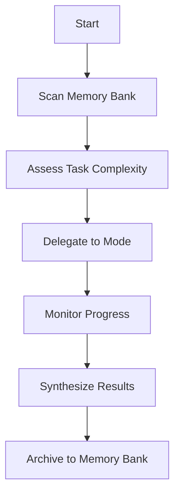
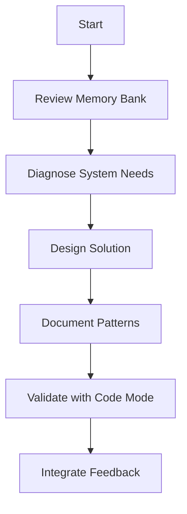
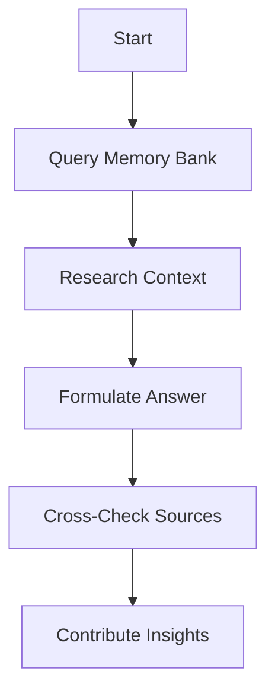
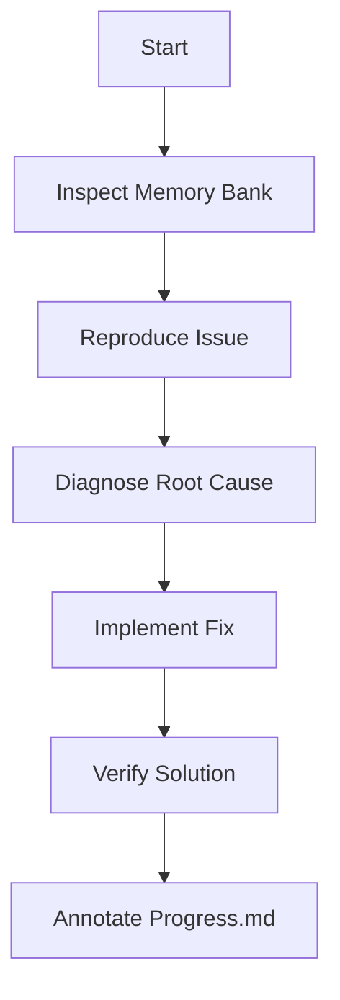
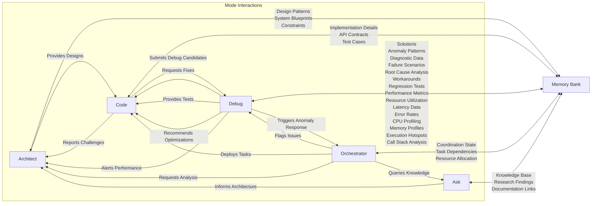
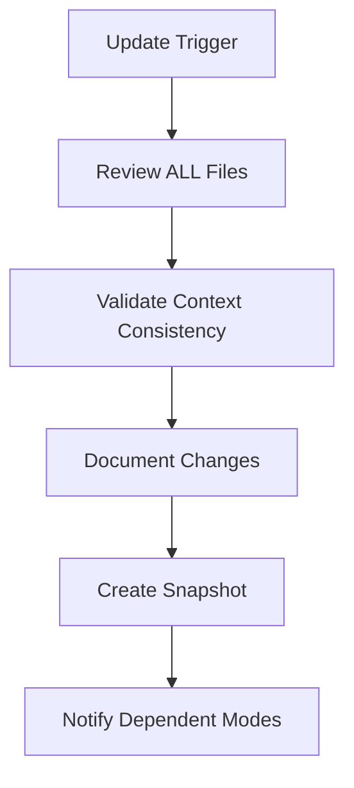

# Memory Bank Implementation Guide

## Enhanced Memory Bank Structure

### Core File Enhancements
1. **activeContext.md**
   - Added anomaly detection patterns
   - Performance profiling data storage
   - Debug context expansion
   
2. **systemPatterns.md**
   - Cross-mode coordination protocols
   - Performance optimization blueprints
   - Anomaly detection frameworks

## Mode-Specific Workflows

### Code Mode Implementation

### Orchestrator Mode Coordination

### Architect Mode Design Process

### Ask Mode Knowledge Flow

### Debug Mode Analysis

## Cross-Mode Coordination System

## Implementation Checklist
1. [ ] Create memory-bank directory structure
2. [ ] Initialize core Markdown files
3. [ ] Implement automatic context propagation
4. [ ] Setup versioned snapshots
5. [ ] Configure validation gateways
6. [ ] Integrate cross-mode coordination
7. [ ] Add anomaly detection patterns
8. [ ] Implement performance profiling hooks
9. [ ] Establish documentation update triggers

## Maintenance Procedures

**Note**: The memory bank must be maintained with precision and clarity as it's the only persistent knowledge store across sessions.